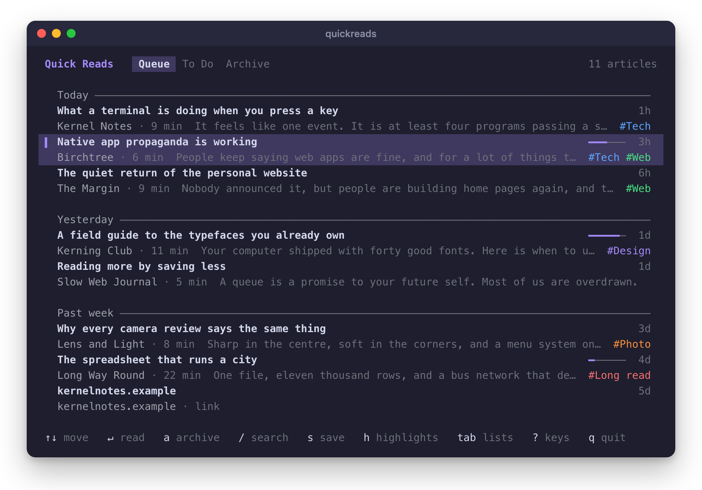
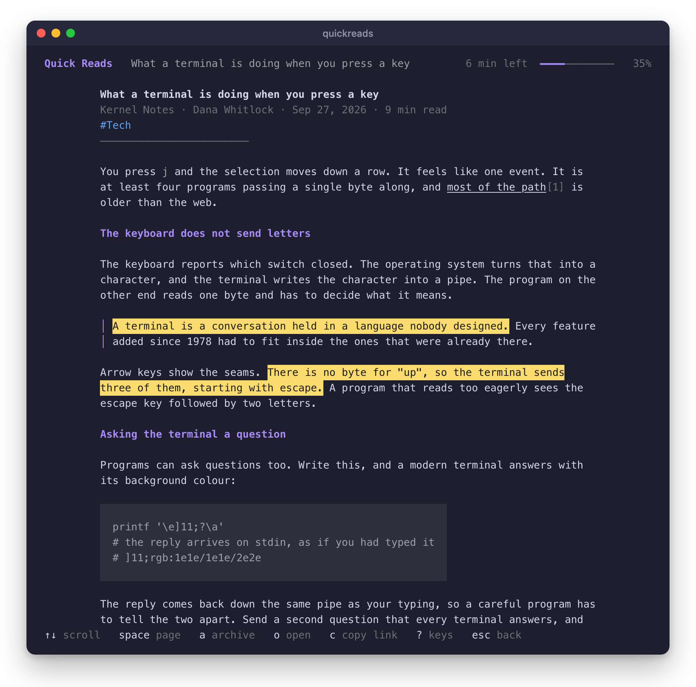
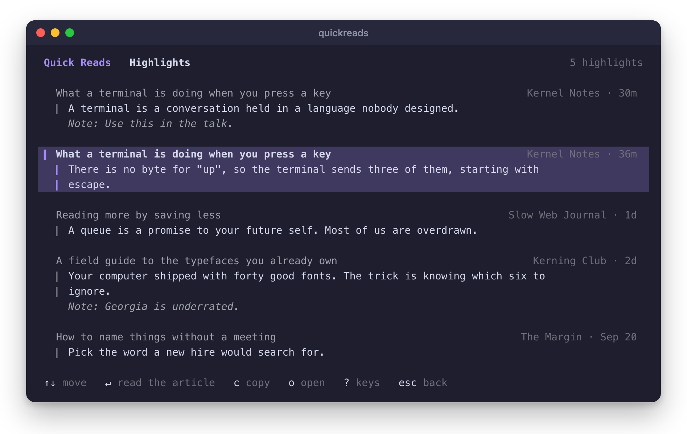
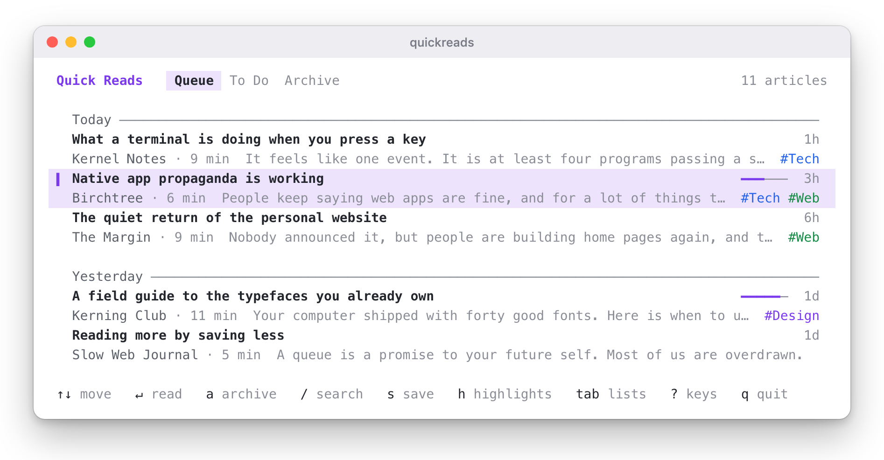
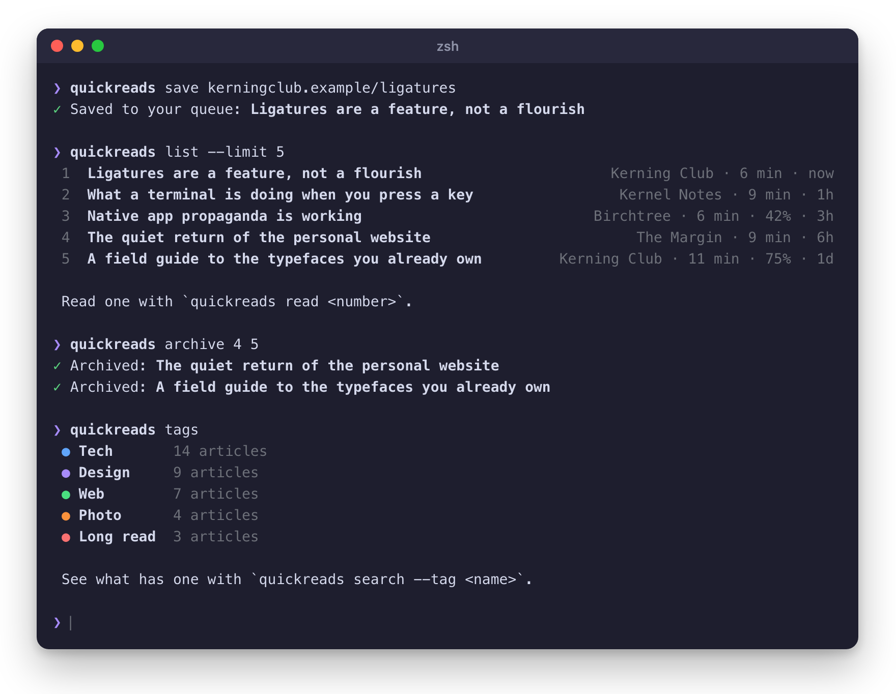

# quickreads

[Quick Reads](https://quickreads.app) in your terminal. Browse your queue,
read articles, save links, search your library, and look through your
highlights.



It talks to the [public Quick Reads API](https://quickreads.app/docs), so you
need a Quick Reads account and an API key.

## Install

With [Homebrew](https://brew.sh) on macOS or Linux:

```sh
brew install mattbirchler/tap/quickreads
```

Or from a clone, on Node 26 or later:

```sh
git clone https://github.com/mattbirchler/quickreads-cli.git
cd quickreads-cli
npm link
```

## Connect your account

Create an API key in Quick Reads under Settings, Developer. Then run:

```sh
quickreads auth
```

Paste the key when asked. On a Mac the key goes in the Keychain. Everywhere
else it goes in `~/.config/quickreads/config.json`, which only you can read.

Set `QUICKREADS_TOKEN` to use a different key for one command. Set
`QUICKREADS_NO_KEYCHAIN=1` on a Mac you reach over SSH, where the Keychain
cannot show its unlock prompt. `quickreads logout` removes the key from the
machine.

## Browse

Run `quickreads` with no arguments.

| Key | Action |
|-----|--------|
| `↑` `↓` or `k` `j` | Move the selection, or scroll the article |
| `Space` `b` | Page down, page up |
| `g` `G` | Jump to the top, the bottom |
| `Enter` | Read the selected article |
| `a` | Archive. In the archive, send it back to the queue |
| `u` | Undo the last archive |
| `s` | Save a link to the list you are looking at |
| `/` | Search everything you have saved |
| `h` | Your highlights. Enter opens the article at that passage |
| `Tab` or `1` `2` `3` | Switch between Queue, To Do, and Archive |
| `o` | Open the original page in your browser |
| `c` | Copy the link, or the highlight |
| `v` | Switch between roomy rows and compact ones |
| `r` | Refresh |
| `?` | Show every key |
| `Esc` | Go back |
| `q` | Quit |

Archiving happens on screen right away and `u` takes it back, so a stray `a`
costs one keypress.

Enter opens the article. Passages you highlighted in Quick Reads are marked in
yellow.



`h` lists your highlights, newest first, with your notes under them.



Roomy rows take two lines each and show the start of the article, its tags, and
how far you have read. Compact rows take one line, so twice as many fit.
`quickreads` remembers which one you chose.

The mouse wheel scrolls the list and the article. The mouse still belongs to
your terminal, so you can select text and copy it as usual.

An article you started elsewhere opens where you stopped. `g` goes back to the
top. In a terminal that supports it, links in the article open when you click
them.

### Colors

`quickreads` asks your terminal for its background color when it starts, and
picks inks that read well on it. The selected row gets a purple tint mixed from
that background. A terminal that does not answer within a quarter of a second
gets the dark inks and a selection in reverse video.

Set `QUICKREADS_THEME` to `dark` or `light` to skip the question. Set
`NO_COLOR` to turn color off. Nothing on screen depends on color alone. A bar
at the left edge marks the selected row, and the current list is in brackets.



## Commands

Every part of the browser is also a command, for scripts and for when you
already know what you want.



```sh
quickreads list                     # the queue, newest first
quickreads list --archived          # the archive
quickreads list --todo              # your To Do list
quickreads list --limit 100         # more rows, the default is 25

quickreads read 3                   # read row 3 of the last listing
quickreads read 3 --width 60        # wrap narrower than the default 80

quickreads save https://example.com/post
quickreads save example.com/app --todo --title "Try this"
pbpaste | quickreads save           # URLs from a pipe, one per line
pbpaste | quickreads save --text    # save the text itself, markdown welcome

quickreads search apple silicon
quickreads search --tag tech        # everything with a tag
quickreads search hdr --tag tech    # both

quickreads highlights               # newest first, across every article
quickreads highlights 3             # the highlights in one article

quickreads archive 1 2 3
quickreads unarchive 1
quickreads open 2                   # in your browser
quickreads tags
quickreads whoami
```

### Article numbers

`list`, `search`, and `highlights` number their rows. Any command that takes an
article accepts one of those numbers, and it means the row from the most recent
listing. It also accepts an article id or a link to the article in Quick Reads.

`archive 1 2 3` checks all three numbers before it changes anything. A typo
stops the command instead of archiving two articles out of three.

### Output for scripts

`--json` prints one JSON object per line, exactly as the API returned it.
`--plain` prints tab-separated columns.

| Command | `--plain` columns |
|---------|-------------------|
| `list`, `search` | id, saved at, site, title, URL |
| `highlights` | article id, created at, text, note |
| `save` | id, title, URL |
| `tags` | id, name, article count |

```sh
quickreads list --json | jq -r 'select(.wordCount > 3000) | .title'
quickreads list --plain | cut -f5 | head -5
quickreads highlights --limit 500 --plain | cut -f3 > highlights.txt
```

Hints and color appear only when the output is a terminal. In a pipe, an empty
result prints nothing with `--json` or `--plain`. `NO_COLOR` turns color off
everywhere.

A command that waits on the server for more than 150 milliseconds shows a
spinner. It draws on stderr and only in a terminal, so it never ends up in a
pipe or a file.

## Reading

Articles wrap to 80 columns at most. Long ones open in your pager, which is
`$QUICKREADS_PAGER`, then `$PAGER`, then `less`. `--no-pager` prints instead.

Links are underlined and numbered, with the addresses listed at the end of the
article. Printed straight to a terminal they are also clickable. Passages you highlighted in Quick Reads are marked in yellow. Images
appear as their alt text.

Some saves have no article text. A To Do item is a link by design, and some
sites refuse to serve their pages to Quick Reads. The reader says which one
happened, and `o` opens the page in your browser.

## Development

Plain TypeScript that Node 26 runs directly. No dependencies and no build step.

```sh
node --test test/*.test.ts
node bin/quickreads.ts help
```

To run against a different server, pass `--server` to `quickreads auth`. Set
`QUICKREADS_HOME` to keep config and cache in a directory of your choosing.

## License

MIT
